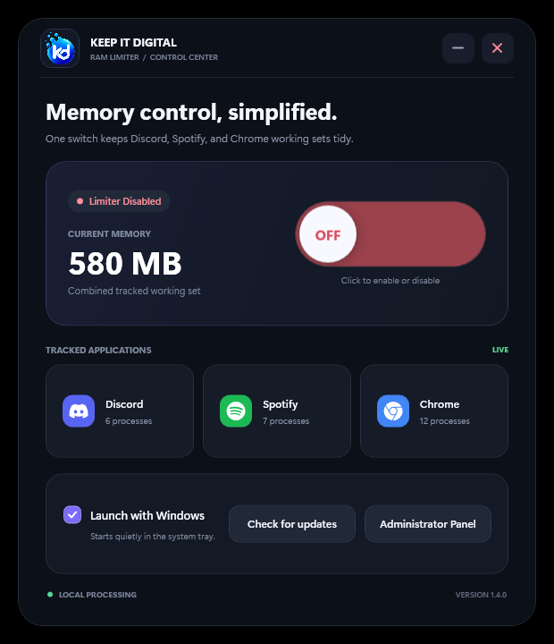

# Keep It Digital RAM Limiter

Keep It Digital RAM Limiter is a small Windows desktop app that monitors Discord, Spotify, and Google Chrome memory usage and can trim their working sets while it runs in the background.

The app uses the native Windows `SetProcessWorkingSetSize(process.Handle, -1, -1)` call on detected Discord, Spotify, and Google Chrome processes when the limiter is enabled.

## Screenshot



## Download

Release builds are created in the `dist` folder:

- `Keep-It-Digital-RAM-Limiter-Setup.exe` — recommended Windows installer.
- `KeepItDigitalRamLimiter.exe` — portable standalone application.
- `update.json` — small update manifest used by installed copies of the app.

The installer needs no administrator access. It creates a Start Menu shortcut so the app appears in Windows Search, and its startup option is enabled by default.

## Antivirus Note

This app is a small unsigned Windows executable. Some antivirus scanners may flag unsigned apps heuristically, especially when they inspect running processes. The release build is not packed or obfuscated, and the source code is available in this repository.

You __do not need__ to disable your antivirus to use this app. If you are unsure, do not run the release build; build the app from source and compare it with the release checksum.

## Features

- Modern control-center dashboard with live application cards.
- Live combined Discord, Spotify, and Google Chrome RAM usage display.
- Separate Discord, Spotify, and Chrome process counts.
- Animated ON/OFF limiter switch.
- Safe background monitor loop with cleanup on exit.
- Minimize-to-tray behavior.
- System tray notification when the app is minimized.
- Tray menu with `Open` and `Exit` actions.
- Optional automatic minimized launch when signing into Windows.
- Start Menu and Windows Search integration through the installer.
- Automatic update check at startup and a manual `Check for updates` button.
- SHA-256 and embedded-version verification before any downloaded installer is opened.
- Supports Discord Stable, Canary, PTB, Development, Spotify, and Google Chrome process names.

## Supported Processes

The limiter looks for these process names:

```text
Discord
DiscordCanary
DiscordPTB
DiscordDevelopment
Spotify
chrome
```

## Requirements

To run either release build:

- 64-bit Windows 10 or newer.
- No separate .NET installation is required.

To build from source:

- Windows 10 or newer.
- .NET 9 SDK with Windows Desktop support.

## Build From Source

Clone or download the repository, then run:

```powershell
dotnet restore .\DiscordRamLimiter.sln
dotnet build .\DiscordRamLimiter.sln
```

## Run From Source

```powershell
dotnet run --project .\DiscordRamLimiter\DiscordRamLimiter.csproj
```

## Create The Portable App And Installer

Install Inno Setup 6 once, then run the release script. It automatically creates download links for the matching release tag in `NoxDevTeam/keepitdigitaldiscordramlimiter`:

```powershell
winget install --id JRSoftware.InnoSetup --exact
.\build-release.ps1
```

The `dist` folder will contain:

```text
Keep-It-Digital-RAM-Limiter-Setup.exe
KeepItDigitalRamLimiter.exe
update.json
```

## Configure Online Updates

The app reads its update manifest from `https://raw.githubusercontent.com/NoxDevTeam/keepitdigitaldiscordramlimiter/main/update.json`. Keep `update.json` in the repository root on the `main` branch.

For each new release:

1. Increase the assembly and file versions in `DiscordRamLimiter/Properties/AssemblyInfo.cs`. The release script reads this version automatically.
2. Replace the text in `release-notes.txt` with that version's release notes.
3. Run `build-release.ps1` with the HTTPS folder that will contain the files.
4. Upload `Keep-It-Digital-RAM-Limiter-Setup.exe` first.
5. Upload `KeepItDigitalRamLimiter.exe` if you want to offer the portable download.
6. Upload `update.json` last. Uploading the manifest last prevents clients from seeing an installer that is not online yet.

The updater only requires the setup executable and `update.json`. The portable executable is optional for the update system, but useful as a separate download.

## Disclaimer

This project is not affiliated with Discord, Spotify, or Google.

Use at your own risk. Trimming process working sets may affect Discord, Spotify, or Chrome performance or stability, and Windows may restore memory usage as an app continues running.

## License

This project is licensed under the MIT License.
