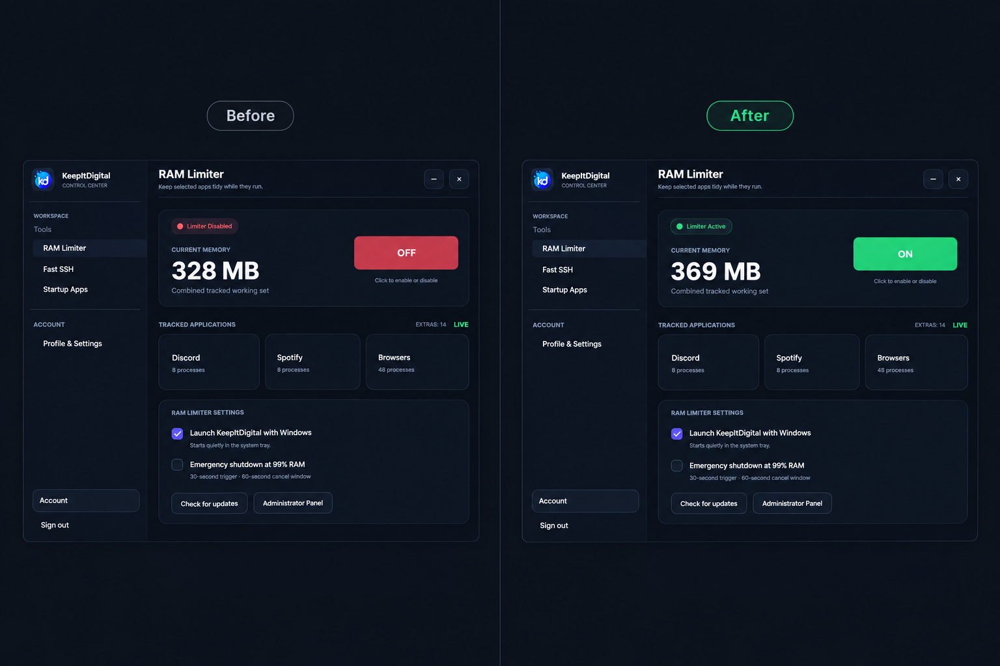

# KeepItDigital

KeepItDigital is a modern Windows desktop application for monitoring and managing application memory usage, with built-in account authentication, email verification, automatic updates, and a polished desktop interface.

The application runs in the background and monitors selected applications and processes. When the limiter is enabled, KeepItDigital can trim the working sets of supported processes using the native Windows:

SetProcessWorkingSetSize(process.Handle, -1, -1)

## Screenshot



---

# Download

The latest version is available from the GitHub Releases page.

### Recommended — Windows Installer

**KeepItDigital-Setup.exe**

The recommended way to install KeepItDigital.

The installer creates the application installation, Start Menu integration, and desktop shortcuts.

### Portable Version

**KeepItDigital-Portable.exe**

A standalone portable version of KeepItDigital.

No installation is required. Download the EXE and run it directly.

### Release Files

Each release contains:

```text
KeepItDigital-Setup.exe
KeepItDigital-Portable.exe
```
---

# What's New

## Authentication & Accounts

KeepItDigital now includes a complete authentication system powered by Supabase.

Features include:

- Account registration.
- Email/password login.
- Account verification.
- Email verification screen.
- Verification status handling.
- Resend verification email.
- Improved authentication error messages.
- Secure session handling.
- Refresh-token support.
- Automatic handling of authentication callbacks.

After registration, KeepItDigital displays a dedicated verification screen explaining that the account must be confirmed by email.

---

The verification flow is:

```text
Create account
      ↓
Verification email
      ↓
Verify email
      ↓
KeepItDigital
      ↓
Account confirmed
      ↓
Sign in
```

KeepItDigital can also resend the verification email if the original message was not received.

The resend function includes a cooldown to prevent repeated requests.

---

# User Interface

KeepItDigital includes a redesigned modern desktop interface.

UI improvements include:

- Rounded application windows.
- Modern dark interface.
- Custom login screen.
- Custom registration screen.
- Custom email verification screen.
- Custom dialogs.
- Animated controls.
- Button hover animations.
- Smooth transitions.
- Fade and slide animations.
- Improved spacing and alignment.
- Improved visual symmetry.
- Modern application cards.
- Improved RAM usage presentation.
- Custom terminal/log display.
- Improved DataGrid styling.
- Custom ON/OFF limiter control.
- Improved Windows desktop appearance.

The application avoids relying on the standard Windows MessageBox experience for normal application dialogs and instead uses its own themed interface.

---

# Memory Limiter

KeepItDigital monitors supported processes and can trim their working sets when the limiter is enabled.

The limiter uses the native Windows API:

```text
SetProcessWorkingSetSize(process.Handle, -1, -1)
```

Windows may restore memory usage as an application continues running, so working-set trimming is not a permanent reduction in an application's memory requirements.

---

# Live Monitoring

The dashboard provides live information about supported applications and their memory usage.

Features include:

- Live application monitoring.
- Live RAM usage.
- Combined application and browser RAM usage.
- Process counts.
- Discord process monitoring.
- Spotify process monitoring.
- Browser process monitoring.
- Additional application monitoring.
- Animated RAM usage transitions.
- Background monitoring.
- Automatic cleanup when the application exits.

---

# Supported Applications

KeepItDigital currently supports a broad range of applications and browsers.

## Discord

```text
Discord
DiscordCanary
DiscordPTB
DiscordDevelopment
```

## Spotify

```text
Spotify
```

## Browsers

```text
chrome
msedge
firefox
brave
opera
vivaldi
chromium
Arc
Dia
Safari
waterfox
librewolf
floorp
zen
thorium
duckduckgo
maxthon
palemoon
basilisk
seamonkey
slimjet
centbrowser
sidekick
wavebox
avastbrowser
avgbrowser
ulaa
qutebrowser
falkon
midori
```

Firefox-based installations such as Tor Browser are also supported where their process names match the supported Firefox process detection.

---

# Additional Supported Applications

KeepItDigital also supports selected user-facing processes from:

```text
NVIDIA App
NVIDIA Overlay
NVIDIA Web Helper
nvsphelper64

RadeonSoftware
AMDRSServ
AMDRSSrcExt
amdow
cncmd

GCC
LEDKeeper2

PhoneExperienceHost
```

---

# Razer Support

KeepItDigital automatically supports current-user Razer application front ends.

This includes applications such as:

```text
Razer Synapse
Razer Central
Razer Cortex
Razer Axon
Razer App Engine
```

Current-user Razer processes can be detected automatically.

For safety, Razer processes containing names associated with protected components are intentionally excluded.

Excluded process-name patterns include:

```text
service
driver
sdk
install
update
elevat
crash
```

This prevents the limiter from targeting device drivers, service components, SDK hosts, installers, update components, or crash-handling processes.

---

# Protected Processes

KeepItDigital intentionally avoids critical Windows and system processes.

The limiter is designed to exclude processes associated with:

- Windows system services.
- Security components.
- Windows shell components.
- Display drivers.
- Device drivers.
- Protected application services.
- Installation and update components.

This reduces the possibility of interfering with critical system functionality.

---

# Emergency RAM Protection

KeepItDigital includes an optional emergency protection feature.

When enabled, the application can monitor total system RAM usage.

If total system RAM remains at:

```text
99% or higher
```

for the configured emergency period, KeepItDigital can initiate an emergency shutdown countdown.

The countdown provides an opportunity to cancel the shutdown.

The default configuration keeps this feature disabled because an emergency shutdown can result in unsaved work being lost.

The emergency protection preference is stored for the current Windows user and is not overwritten by normal application updates.

---

# Background Operation

KeepItDigital can continue running in the background.

Features include:

- Minimize-to-tray support.
- System tray notifications.
- Tray menu.
- Open action.
- Exit action.
- Background monitoring.
- Optional minimized startup.
- Cleanup when the application exits.

---

# Antivirus Note

KeepItDigital is a Windows desktop executable that monitors other application processes and can interact with their working sets.

Because the application interacts with running processes, some antivirus or security products may occasionally apply heuristic detections to unsigned or newly released builds.

The application is not intentionally packed or obfuscated.

If a security product reports a false positive:

1. Do not disable your antivirus blindly.
2. Verify that the file was downloaded from the official GitHub Release.
3. Compare the release checksum when available.
4. Alternatively, build KeepItDigital directly from source.

Use the application only if you trust the source and release.

---

# System Requirements

## Running KeepItDigital

- Windows 10 or newer.
- 64-bit Windows.
- x64 processor.
- Internet connection for authentication and update checking.

---

# Disclaimer

KeepItDigital is an independent project.

This project is not affiliated with:

- Discord
- Spotify
- Google
- Microsoft
- NVIDIA
- AMD
- Razer

Memory working-set trimming can affect application performance or stability.

Windows may restore memory usage after a working-set trim.

Use the emergency shutdown feature carefully because shutdown can result in unsaved work being lost.

Use KeepItDigital at your own risk.
